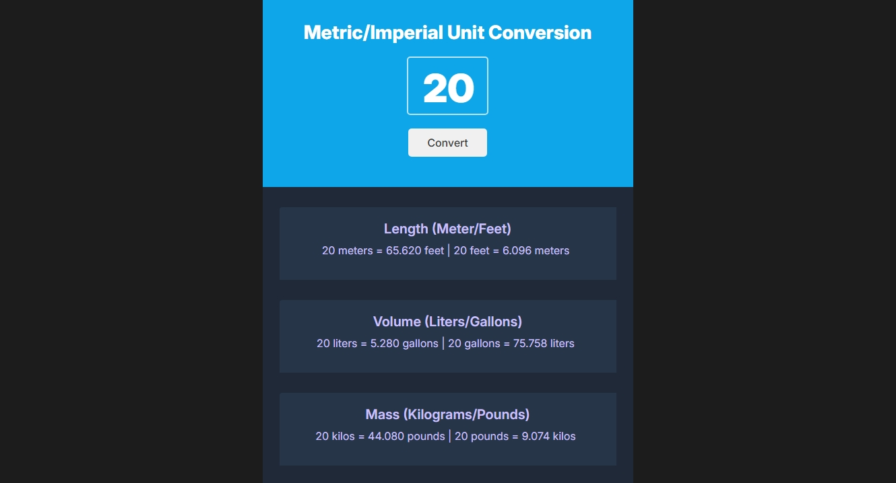

# Metric/Imperial Unit Conversion

A simple web application for converting between metric and imperial units.

## Features

*   **Length Conversion:** Converts between meters and feet.
*   **Volume Conversion:** Converts between liters and gallons.
*   **Mass Conversion:** Converts between kilograms and pounds.
*   **Real-time Conversion:** Enter a value and see the conversions instantly.

## Technologies Used

*   HTML
*   CSS
*   JavaScript

## Web

https://facukis.github.io/metric-imperial-conversion/
